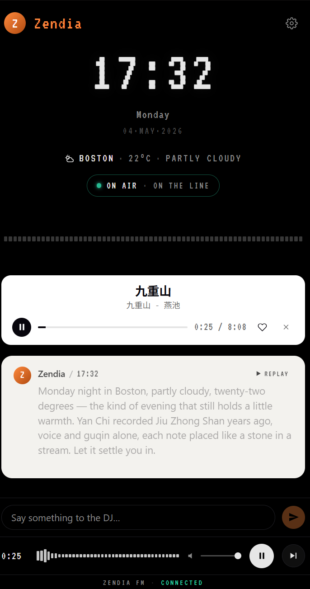

<p align="center">
  
</p>

# Zendia

> 中文 · [English](./README.md)

<p align="center">
  
</p>

私人 AI 电台:读懂你的听歌习惯,规划声音段落,像一个 DJ 一样在歌曲之间开口说话。

## 架构

Zendia 拆成两个 app:

- **`server/`** — Node.js 中枢:Express API + WebSocket 流 + SQLite 状态 + Claude
  子进程适配器 + 网易云音乐查询 + Fish Audio TTS 缓存。
- **`web/`** — Vite + React PWA:移动优先的播放器 UI、实时消息时间线、音乐播放、
  TTS 播放、波形可视化。

运行时数据流:

```text
用户语料 / 环境 / 历史 → Claude DJ 契约 → { say, play[], reason, segue }
  → 持久化消息
  → Fish 合成 DJ 声音
  → 网易云解析音乐 URL
  → WebSocket 把 message / song 事件推给 PWA
```


## 开发模式(两个终端)

```bash
cd server
npm install
npm run dev
```

```bash
cd web
npm install
npm run dev
```

默认端口:

- Server: `http://localhost:8910`
- Web: `http://localhost:5173`
- WebSocket: `/stream`
- 当前快照: `/api/now`

如果 `8910` 被别的项目占了,用 `PORT=xxxx npm run dev` 改端口,
同时保持 Vite proxy(`web/vite.config.ts` 的 `ZENDIA_SERVER_PORT`)对齐。

## 生产部署 / 局域网(Mac mini,家庭电台模式)

一个 Node 进程同时服务 PWA + API + WebSocket,绑 0.0.0.0,
家里同一 WiFi 下的任意设备都能用浏览器访问。

### Mac 上首次配置

```bash
brew install node                         # 没装 Node 22+ 的话
npm install -g @anthropic-ai/claude-code  # 装 claude CLI,跑一次登录
git clone <你的 repo URL> Zendia
cd Zendia
npm run install:all                       # 一次装好 server + web 依赖
cp server/.env.example server/.env
# 编辑 server/.env,填:
#   NCM_COOKIE=MUSIC_U=...
#   FISH_API_KEY=...
#   FISH_VOICE_ID_ZH=...     FISH_MODEL_ZH=...
#   FISH_VOICE_ID_EN=...     FISH_MODEL_EN=...
```

### Build + 起服务

```bash
npm run build      # build PWA → web/dist
npm start          # 起 Node server,自动 serve dist
```

启动日志会把所有可达 URL 打出来:

```
[zendia] PWA serve: on (web/dist found)
[zendia] listening on:
           http://localhost:8910
           http://192.168.1.42:8910
```

把局域网那行(`192.168.1.x:8910`)在手机 / iPad 浏览器打开就能听。

### 在 iPhone 上听 + 装 PWA

1. iPhone 和 Mac **必须同一 WiFi**(4G/5G 不行)
2. **Safari**(不是 Chrome)地址栏输入 `http://192.168.1.42:8910`
3. 必须**亲手点一下**白色卡片的 ▶ 才能播音(iOS autoplay 政策)
4. 装到主屏:Safari 底部分享 → 添加到主屏幕,出现一个橘色 Z 图标,
   点开全屏沉浸,跟原生 app 一样

⚠️ Safari 切到后台 / 锁屏 → 音频暂停。这是 iOS 政策,不是 bug。
后台播放需要做原生 audio session 处理,后续再说。

### 代码更新后

```bash
git pull
npm run install:all
npm run build
# 当前 server 的终端 Ctrl+C,然后:
npm start
```

让 Mac 开机自启(不用一直开终端) — 用 `launchd` plist,
后续会写一个模板放在 `deploy/` 下。

## 换 LLM 后端(国内用户必看)

DJ 大脑是可插拔的,默认走本机的 `claude` CLI。如果你装不了 / 用不了
Claude Code,可以切到任意 OpenAI 兼容的 API,把 DeepSeek / 通义千问 /
Kimi / 本地 Ollama 当 DJ 大脑用。

在 `server/.env` 里设:

```bash
ZENDIA_LLM=openai
OPENAI_BASE_URL=https://api.deepseek.com/v1   # DeepSeek 示例
OPENAI_API_KEY=sk-...
OPENAI_MODEL=deepseek-chat
```

常见 base URL + model:

| 服务 | `OPENAI_BASE_URL` | `OPENAI_MODEL` |
|---|---|---|
| DeepSeek | `https://api.deepseek.com/v1` | `deepseek-chat` |
| 通义千问 (Qwen) | `https://dashscope.aliyuncs.com/compatible-mode/v1` | `qwen-plus` |
| Moonshot (Kimi) | `https://api.moonshot.cn/v1` | `moonshot-v1-8k` |
| OpenAI | `https://api.openai.com/v1` | `gpt-4o-mini` |

切完跑 `cd server && npm run llm:smoke`,看到 `[llm smoke] text:` 后面有
JSON 输出就说明这条链路通了。

## 环境变量

复制 `server/.env.example` 到 `server/.env`,填本地 secrets。
**`.env` 默认 gitignore,绝对不要 commit、也不要分享 / 截图。**

| 变量 | 必填 | 说明 |
|---|---|---|
| `ZENDIA_LLM` | 可选 | DJ 大脑后端。`claude-cli`(默认)或 `openai` |
| `OPENAI_BASE_URL` | `openai` 时必填 | OpenAI 兼容 endpoint(见上表) |
| `OPENAI_API_KEY` | `openai` 时必填 | 对应平台的 API key |
| `OPENAI_MODEL` | `openai` 时必填 | 对应平台的模型名 |
| `NCM_COOKIE` | 推荐 | 网易云的 `MUSIC_U` cookie。没 cookie 大量主流华语歌(VIP 锁)放不出 |
| `FISH_API_KEY` | 必填 | Fish Audio API key,DJ 声音合成需要 |
| `FISH_VOICE_ID_ZH` | 可选 | 中文 DJ 用的 voice id |
| `FISH_MODEL_ZH` | 可选 | 中文 voice 对应的模型(如 `s1`) |
| `FISH_VOICE_ID_EN` | 可选 | 英文 DJ 用的 voice id |
| `FISH_MODEL_EN` | 可选 | 英文 voice 对应的模型(如 `s2-pro`) |
| `FISH_VOICE_ID` | 可选 | 全局 fallback voice |
| `FISH_MODEL` | 可选 | 全局 fallback 模型,默认 `speech-1.6` |

### NCM cookie 怎么拿

1. 浏览器登录 https://music.163.com/
2. F12 → Application → Cookies → 找 `MUSIC_U`,复制 value
3. `.env` 里写 `NCM_COOKIE=MUSIC_U=<那一长串>`(注意是整个 `MUSIC_U=xxx` 格式)

⚠️ MUSIC_U 等同账号密码 — 泄露了请去 music.163.com 退出登录让 token 失效,
然后重新登录拿新的。

### Fish voice 怎么拿

1. 去 https://fish.audio,注册登录
2. Voice Library 找一个喜欢的;voice 详情页 URL 长这样:
   `https://fish.audio/m/<32位 uuid>/...?version=<模型>`
3. **modelId** 那段是 voice id,**version** 是模型 id,两个一起填

## DJ 语言策略

- 英文歌 → 英文 DJ + 英文 voice
- 中文 / 日文 / 韩文 / 纯音乐 / 未知 → 中文 DJ + 中文 voice
- 你打字 chat → DJ 跟你的语言

(默认偏中文,因为非英文 voice 是中文,日韩文用中文 voice 念会乱)

## 故障排查速查

| 现象 | 多半是 |
|---|---|
| `EADDRINUSE :::8910` | 上次的 server 没退干净。`Get-NetTCPConnection -LocalPort 8910 -State Listen | % { Stop-Process -Id $_.OwningProcess -Force }`(Windows)/ `lsof -ti:8910 | xargs kill -9`(Mac) |
| `command line is too long` | 历史消息太长撑爆了 systemPrompt。已经做了 stdin 兜底,如果还撞:`rm server/state.db*` 重置 |
| `[live] could not resolve any of: [...]` | 模型推荐的歌全部 NCM 拿不到 URL。要么没 cookie,要么模型推了一堆英文老歌 |
| 浏览器 `Cannot GET /` | 你打到了 server 的端口(8910),前端 dev 时在 5173 |
| 装了 PWA 但 audio 不响 | iOS 必须**手动点一下**播放键解锁 |
| Vite 启动卡 5173 占用 | Vite 自动跳 5174 / 5175,看启动日志最后一行真实端口 |
